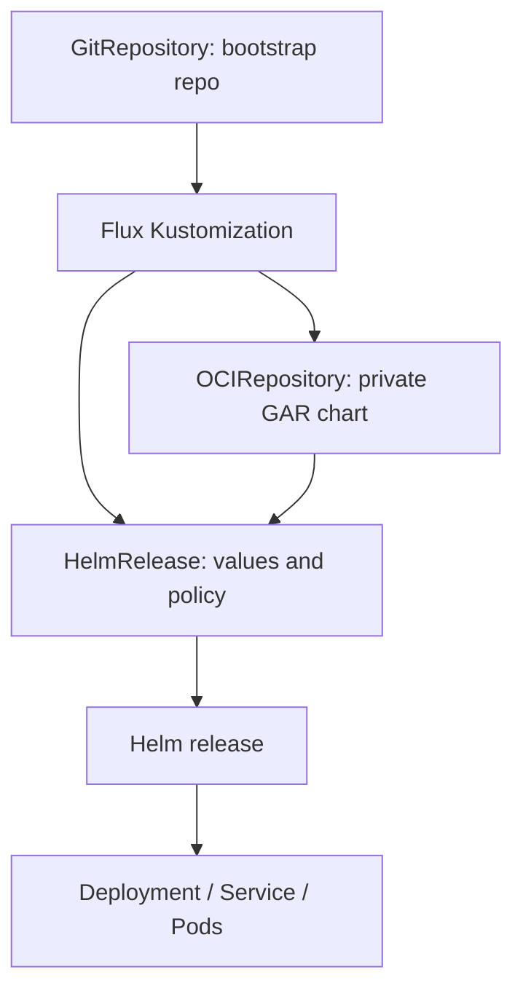

# Flux on GKE with private OCI

**Time:** 6–8 hours · **Outcome:** Git automatically deploys the Helm chart

## Resource chain



`HelmRepository` represents an HTTP Helm repository. This course uses Artifact Registry's OCI format, so the correct source is `OCIRepository` with `provider: gcp`. `HelmRelease.spec.chartRef` references it directly.

## Authentication boundaries

- The local Flux CLI uses `GITHUB_TOKEN` only during bootstrap.
- The in-cluster Git source uses the bootstrap credentials created by Flux.
- `source-controller` uses GKE Workload Identity to obtain short-lived Google credentials.
- The mapped Google service account receives only `roles/artifactregistry.reader`.
- No Google service-account key is created or committed.

## Bootstrap is declarative

`flux bootstrap github` installs controllers and commits their manifests plus the cluster sync configuration to GitHub. Persist later controller customizations—such as the `source-controller` service-account annotation—in the bootstrap repository. A one-off `kubectl annotate` proves a concept but Git must hold the durable desired state.

## Reconciliation evidence

A successful Pod is not enough. Prove the whole chain:

```bash
flux get sources git -A
flux get sources oci -A
flux get kustomizations -A
flux get helmreleases -A
helm list -n "$APP_NAMESPACE"
kubectl get deployment,pods,service -n "$APP_NAMESPACE"
```

Each object should report a ready condition and the expected revision or chart version.
