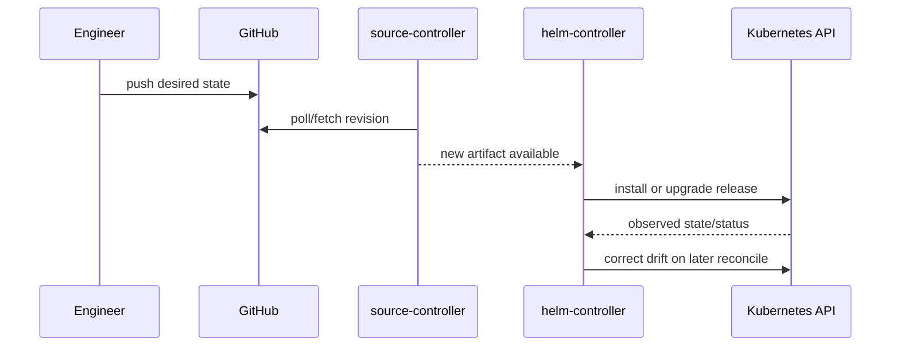

# GitOps fundamentals and Flux architecture

**Time:** 6 hours · **Cluster changes:** none

## Desired outcome

Explain how Git becomes the declared state, how Flux detects a new revision, and which controller owns each step.

## Pull versus push

| Concern | CI/CD push | GitOps pull |
|---|---|---|
| Initiator | External pipeline | In-cluster controller |
| Cluster credentials | Usually available to CI | Remain in the cluster |
| Drift | Often invisible until next deploy | Continuously observed and corrected |
| Audit trail | Pipeline plus deployment commands | Git history plus controller events |
| Failure surface | Pipeline logs | Resource conditions, events, controller logs |

Pull delivery does not automatically make a system secure. Repository permissions, controller permissions, artifact integrity, and secret handling still matter.

## Reconciliation

A reconciler repeatedly compares **desired state** with **observed state**, performs an action when they differ, records conditions, then checks again. It is not a one-time deployment script.

## Core controllers

- **source-controller:** fetches Git, Helm, bucket, and OCI sources and produces immutable source artifacts.
- **kustomize-controller:** builds and applies Kubernetes manifests from source artifacts; also performs health checks and pruning.
- **helm-controller:** translates `HelmRelease` intent into Helm install, upgrade, test, remediation, and uninstall actions.
- **notification-controller:** routes inbound events and outbound alerts; it does not deploy workloads.

## Trace the ownership

For the final project:

1. A Flux `GitRepository` represents the bootstrap repository.
2. A Flux `Kustomization` applies the app configuration from Git.
3. An `OCIRepository` fetches the Helm chart from Artifact Registry.
4. A `HelmRelease` tells `helm-controller` to install the fetched chart.
5. Kubernetes controllers operate the resulting Deployment, ReplicaSet, Pod, and Service.

A useful debugging question is: **which controller owns the resource whose condition is failing?**
