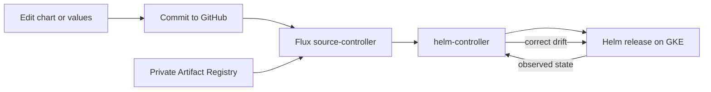

# Helm + Flux GitOps Learning Path

Build practical Helm and Flux skills on a GKE cluster you already own. This topic-based path is self-paced and ends with Git automatically driving a private OCI-hosted Helm release.

## What you will build

By the end, you will be able to:

- explain GitOps pull delivery and Flux controller responsibilities;
- develop, test, package, and version an advanced Helm chart;
- publish Helm charts as OCI artifacts to private Artifact Registry;
- bootstrap Flux against GitHub and authenticate to Google Cloud with Workload Identity;
- deploy an `OCIRepository` through a `HelmRelease`;
- diagnose drift, failed reconciliation, and failed Helm actions;
- compare Flux pull delivery with CI/CD push delivery;
- debug Helm template scope, schema, atomic upgrades, and rollout behavior;
- design Flux dependencies, values composition, pruning, drift rules, RBAC, and secret handling;
- solve realistic interview scenarios and present a portfolio-ready capstone.

## Course format

Every topic follows the same loop:

1. **Learn** the concepts.
2. **Practice** with progressive labs.
3. **Validate** with observable commands.
4. **Quiz** yourself without notes.
5. **Pass a gate** before moving forward.

Solutions are deliberately kept in a [separate section](solutions/week-1.md). Work through GitOps fundamentals, advanced Helm and OCI, Flux on GKE, and GitOps operations in sequence. Try each lab first, record the output you expected, and use the solution only after you can explain where you became stuck.

!!! warning "Use a non-production cluster"
    The labs install controllers, create workloads, and deliberately introduce failures. Reuse your GKE learning cluster, not a production cluster. Always verify `kubectl config current-context` before a mutating command.

## Start here

1. Review the [roadmap](getting-started/roadmap.md).
2. Install the [prerequisites](getting-started/prerequisites.md).
3. Define your [environment variables](getting-started/environment.md).
4. [Connect to GKE](getting-started/gke-connection.md).

The original source plan remains available as `Helm_Flux_GitOps_Plan.md` in the repository root.
