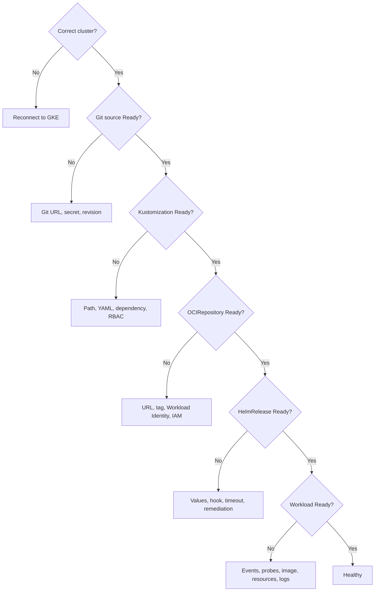

# Troubleshooting

Diagnose before editing. Start at the earliest non-Ready layer.



## Wrong cluster

```bash
kubectl config current-context
gcloud container clusters get-credentials "$CLUSTER_NAME" \
  --location "$CLUSTER_LOCATION" --project "$PROJECT_ID"
```

## Git bootstrap or source failure

```bash
flux get sources git -A
kubectl describe gitrepository flux-system -n flux-system
kubectl logs deployment/source-controller -n flux-system --since=10m
```

Confirm repository ownership/admin access, branch, path, and token scope. Never paste the token into issue output.

## Private OCI: unauthorized

```bash
flux get sources oci -A
kubectl describe ocirepository "$CHART_NAME" -n "$APP_NAMESPACE"
kubectl get serviceaccount source-controller -n flux-system -o yaml
gcloud iam service-accounts get-iam-policy "$GSA_EMAIL" --project "$PROJECT_ID"
gcloud artifacts repositories get-iam-policy "$GAR_REPOSITORY" \
  --location="$GAR_LOCATION" --project="$PROJECT_ID" \
  --flatten='bindings[].members' \
  --filter="bindings.members:serviceAccount:${GSA_EMAIL}"
```

A `401` or `403` usually indicates identity or IAM. Verify the GKE workload pool, KSA annotation, Workload Identity User binding, and Artifact Registry Reader role.

## Private OCI: not found

Check the exact host, project, repository, chart name, and tag:

```bash
gcloud artifacts docker images list \
  "${GAR_HOST}/${PROJECT_ID}/${GAR_REPOSITORY}" \
  --include-tags --project "$PROJECT_ID"
```

## HelmRelease failure

```bash
flux get helmreleases -A
kubectl describe helmrelease "$RELEASE_NAME" -n "$APP_NAMESPACE"
helm history "$RELEASE_NAME" -n "$APP_NAMESPACE"
kubectl get events -n "$APP_NAMESPACE" --sort-by='.lastTimestamp'
flux logs --kind=HelmRelease --name="$RELEASE_NAME" \
  -n "$APP_NAMESPACE" --level=error
```

## Reconciliation seems slow

Intervals are deliberate. First confirm a new Git revision exists, then request one reconcile rather than repeatedly editing resources:

```bash
flux reconcile source git flux-system
flux reconcile kustomization apps --with-source
```

## Escalation record

Capture resource YAML with secrets redacted, conditions, events, controller logs, Git SHA, chart version, cluster version, Flux version, and the first observed failure time.
